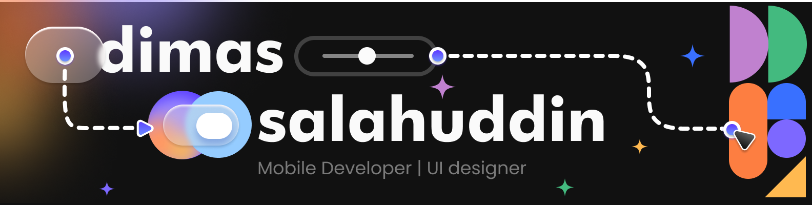

###

## Hello World! Dimas here 

###

Hey there! 👋 I'm a Flutter developer who loves creating awesome apps for Android and iOS. Right now, I'm living the freelance life on Upwork, turning cool ideas into sleek mobile apps. 🚀 When I’m not coding, you’ll probably find me geeking out over the latest tech trends or perfecting my coffee game. ☕ Let's build something amazing together!

###

## ⚙️ Tech Stack

###

  
  
  

###
<picture>
  <source media="(prefers-color-scheme: dark)" srcset="https://raw.githubusercontent.com/DimasSalah/DimasSalah/output/github-snake-dark.svg" />
  <source media="(prefers-color-scheme: light)" srcset="https://raw.githubusercontent.com/DimasSalah/DimasSalah/output/github-snake.svg" />
  
</picture>
###